# Resultados

Esta carpeta contiene los resultados obtenidos durante la evaluación de la versión mejorada del algoritmo **Artificial Bee Colony (ABC) Multiobjetivo** aplicado al problema de optimización de rutas con métricas de Calidad de Servicio (QoS).

Los scripts utilizados para generar estos resultados se encuentran documentados en:

```text
Ejecucion/README.md
```

---

## Estructura

```text
Resultados/
│
├── Mejorada/
│   ├── 01_Verificacion/
│   ├── 02_ExperimentoIteraciones/
│   │   └── Visualizaciones/
│   ├── 03_MultiplesSemillas/
│   │   └── Visualizaciones/
│   ├── 04_Reproducibilidad/
│   ├── 05_FrenteReferencia/
│   └── 05_MultiplesPares/
│
└── ComparacionOriginalMejorada/
    └── Visualizaciones/

Los resultados se encuentran organizados de acuerdo con las diferentes etapas del proceso experimental.

---

# 1. Verificación de rutas y métricas

Antes de realizar experimentos con múltiples iteraciones y semillas, se verificó de forma independiente que las rutas producidas por el algoritmo fueran válidas y que las métricas QoS fueran calculadas correctamente.

Se analizaron 30 soluciones pertenecientes al frente de Pareto.

### Resultados

| Verificación | Resultado |
|---|---:|
| Rutas válidas | 30 / 30 |
| Latencias correctas | 30 / 30 |
| Pérdidas correctas | 30 / 30 |
| Jitters correctos | 30 / 30 |
| Anchos de banda correctos | 30 / 30 |
| Fitness completamente correcto | 30 / 30 |

Los valores fueron recalculados independientemente a partir de los enlaces que forman cada ruta.

Esto permitió comprobar que:

```text
✓ Las rutas respetan la topología de la red.
✓ Las rutas inician y terminan en los nodos correspondientes.
✓ No existen enlaces inexistentes dentro de las rutas.
✓ Las métricas QoS almacenadas coinciden con el cálculo independiente.
```

---

# 2. Verificación del frente de Pareto

Posteriormente se verificó que el frente generado realmente estuviera compuesto por soluciones no dominadas.

### Resultado

| Elemento | Cantidad |
|---|---:|
| Soluciones analizadas | 30 |
| Soluciones dominadas | 0 |
| Rutas duplicadas | 0 |
| Objetivos duplicados | 0 |

Por lo tanto:

```text
RESULTADO: FRENTE PARETO VÁLIDO
```

Esto confirma que ninguna de las soluciones almacenadas era superada simultáneamente en todos los objetivos por otra solución del mismo frente.

---

# 3. Óptimos individuales exactos

Para disponer de valores externos de referencia se calcularon los óptimos individuales de cada métrica QoS.

| Métrica | Óptimo exacto |
|---|---:|
| Latencia | 32.5950993457 ms |
| Pérdida | 0.0018911285 |
| Jitter | 2.7995798723 ms |
| Ancho de banda | 508.4479901466 Mbps |

Durante la ejecución utilizada para esta verificación, ABC alcanzó:

```text
Gap Latencia:       0 %
Gap Pérdida:        0 %
Gap Jitter:         0 %
Gap Ancho de banda: 0 %
```

Por lo tanto, en esta ejecución el algoritmo logró alcanzar los cuatro valores de referencia.

> Estos valores corresponden a óptimos individuales de cada objetivo y no representan un frente de Pareto exacto completo.

---

# 4. Selección del número de iteraciones

Para determinar una cantidad adecuada de iteraciones se probaron:

```text
25
50
100
150
250
400
```

Cada configuración fue ejecutada utilizando 10 semillas diferentes.

### Resumen

| Iteraciones | Tiempo promedio (s) | Pareto promedio | Diversidad promedio | Éxito completo |
|---:|---:|---:|---:|---:|
| 25 | 6.04 | 20.6 | 0.9280 | 10 % |
| 50 | 10.33 | 24.9 | 0.9267 | 30 % |
| 100 | 18.19 | 30.0 | 0.9274 | 60 % |
| 150 | 27.70 | 31.1 | 0.9285 | 70 % |
| 250 | 47.68 | 33.5 | 0.9278 | 100 % |
| 400 | 76.26 | 35.9 | 0.9275 | 100 % |

---

## 4.1 Tasa de éxito completo

<p align="center">
  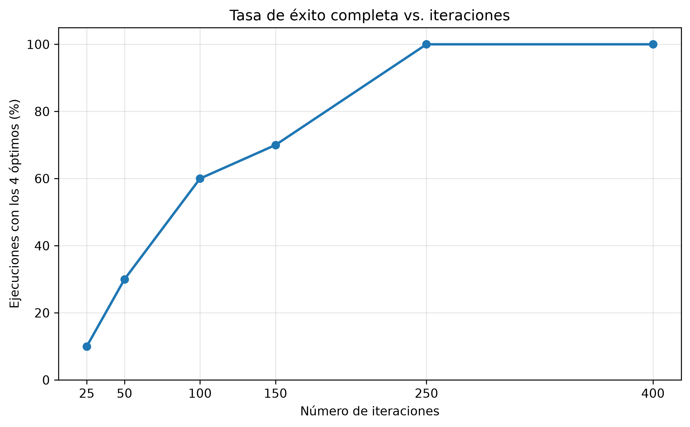
</p>

La gráfica muestra un incremento progresivo de la tasa de éxito conforme aumenta el número de iteraciones.

Se obtuvo:

```text
25 iteraciones  →  10 %
50 iteraciones  →  30 %
100 iteraciones →  60 %
150 iteraciones →  70 %
250 iteraciones → 100 %
400 iteraciones → 100 %
```

Las **250 iteraciones** fueron la primera configuración evaluada que alcanzó los cuatro óptimos individuales en las diez semillas utilizadas.

Aumentar a 400 iteraciones no produjo una mejora adicional en la tasa de éxito.

---

## 4.2 Tiempo promedio de ejecución

<p align="center">
  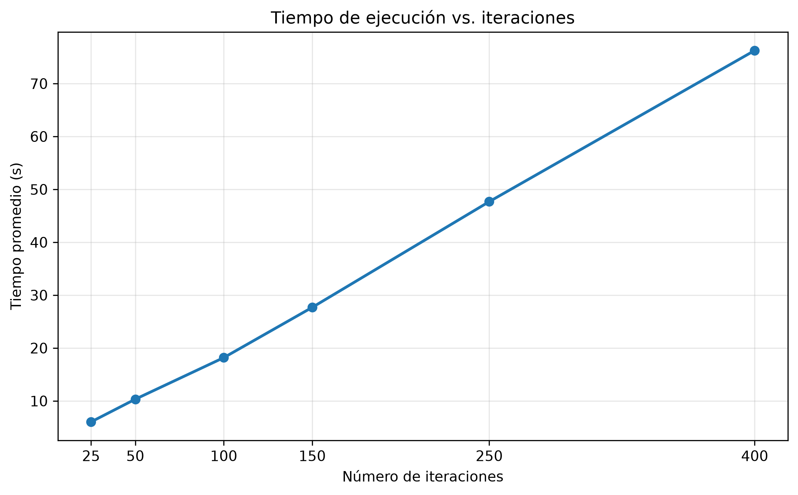
</p>

El tiempo de ejecución aumenta conforme se incrementa el número de iteraciones.

En particular:

```text
250 iteraciones → aproximadamente 47.68 s
400 iteraciones → aproximadamente 76.26 s
```

El incremento hasta 400 iteraciones representa un costo computacional considerable sin mejorar la tasa de éxito obtenida con 250 iteraciones.

Esto fue uno de los principales motivos para seleccionar **250 iteraciones** como configuración definitiva.

---

## 4.3 Tamaño promedio del frente Pareto

<p align="center">
  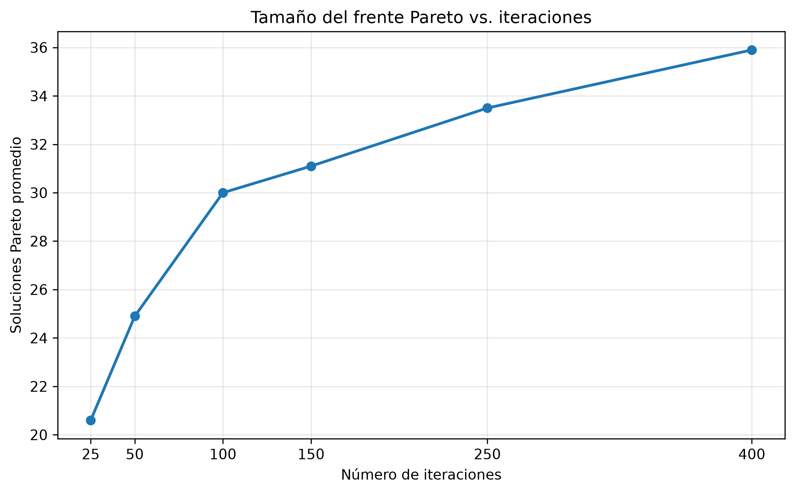
</p>

El tamaño promedio del frente aumenta con el número de iteraciones:

```text
25  → 20.6 soluciones
50  → 24.9 soluciones
100 → 30.0 soluciones
150 → 31.1 soluciones
250 → 33.5 soluciones
400 → 35.9 soluciones
```

Esto indica que una mayor cantidad de iteraciones permite descubrir nuevas alternativas no dominadas.

Sin embargo, entre 250 y 400 iteraciones el incremento fue únicamente de aproximadamente:

```text
2.4 soluciones Pareto adicionales
```

mientras que el costo computacional aumentó considerablemente.

---

## 4.4 Diversidad

<p align="center">
  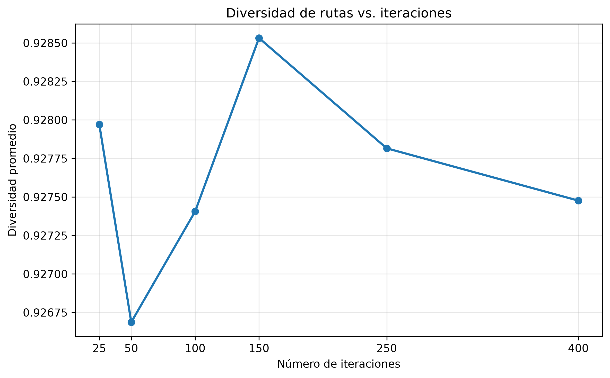
</p>

La diversidad promedio se mantuvo aproximadamente entre:

```text
0.9267 y 0.9285
```

durante todas las configuraciones.

Aunque visualmente la gráfica puede mostrar variaciones, el rango del eje vertical es reducido.

Por lo tanto, la interpretación principal es que **la diversidad permaneció estable** al aumentar el número de iteraciones.

Esto indica que el incremento de iteraciones no provocó una pérdida significativa de variedad entre las rutas de la población.

---

## 4.5 Éxito por objetivo

<p align="center">
  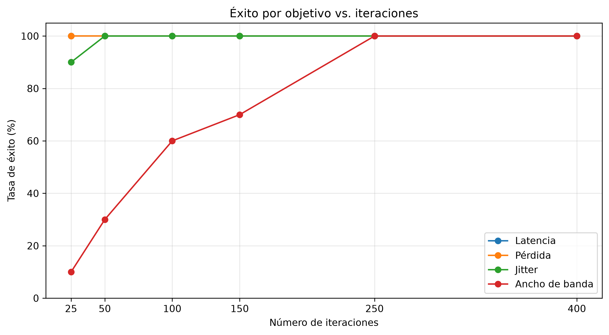
</p>

La gráfica permite observar que no todos los objetivos presentan la misma dificultad.

La latencia y la pérdida fueron alcanzadas con alta frecuencia incluso utilizando configuraciones pequeñas.

El jitter también mostró una rápida convergencia.

El **ancho de banda** fue el objetivo que requirió una mayor cantidad de iteraciones para alcanzar consistentemente su óptimo.

Esto sugiere que encontrar la ruta con el mejor cuello de botella requiere una mayor exploración del espacio de búsqueda.

---

# 5. Configuración seleccionada

A partir del experimento anterior se estableció la siguiente configuración para los experimentos posteriores:

| Parámetro | Valor |
|---|---:|
| Número de abejas | 30 |
| Iteraciones | 250 |
| Tamaño máximo Pareto | 100 |
| Longitud máxima de ruta | 25 |
| Límite de estancamiento | 60 |

Las 250 iteraciones fueron seleccionadas porque proporcionaron un equilibrio adecuado entre:

```text
Calidad de las soluciones
        +
Tasa de éxito
        +
Diversidad
        +
Costo computacional
```

---

# 6. Experimento con 30 semillas

Una vez establecida la configuración final, se realizaron 30 ejecuciones independientes utilizando:

```text
Seeds = 1 ... 30
```

El objetivo fue analizar la estabilidad del algoritmo frente a diferentes secuencias aleatorias.

### Resumen

| Indicador | Resultado |
|---|---:|
| Corridas | 30 |
| Tiempo promedio | 60.51 s |
| Pareto promedio | 33.50 |
| Diversidad promedio | 0.9258 |
| Éxito completo | 96.67 % |

---

## 6.1 Éxito por objetivo

<p align="center">
  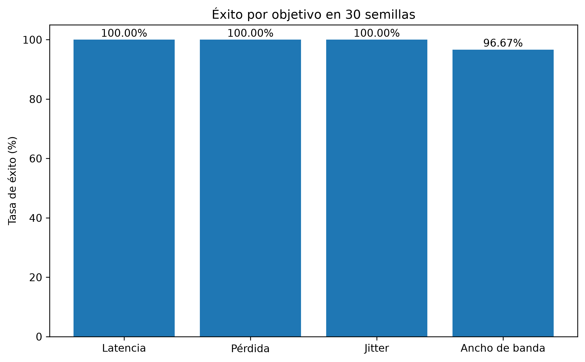
</p>

Los resultados muestran:

| Objetivo | Éxito |
|---|---:|
| Latencia | 100 % |
| Pérdida | 100 % |
| Jitter | 100 % |
| Ancho de banda | 96.67 % |

Los óptimos de:

```text
Latencia
Pérdida
Jitter
```

fueron encontrados en las 30 ejecuciones.

El ancho de banda fue encontrado exactamente en:

```text
29 de las 30 ejecuciones
```

Por lo tanto, el algoritmo obtuvo los cuatro óptimos individuales simultáneamente en:

```text
96.67 % de las corridas
```

---

## 6.2 Tamaño del frente Pareto por semilla

<p align="center">
  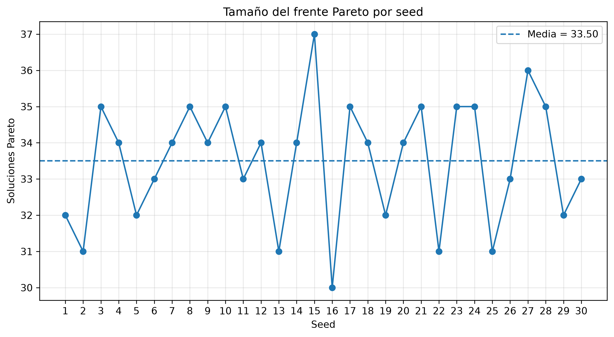
</p>

El número de soluciones no dominadas se mantuvo aproximadamente entre:

```text
30 y 37 soluciones
```

con una media de:

```text
33.5 soluciones
```

No se observa una variación excesiva entre semillas.

Esto sugiere que diferentes secuencias aleatorias producen frentes de tamaños similares, proporcionando evidencia de estabilidad en el comportamiento del algoritmo.

---

## 6.3 Gap del ancho de banda

<p align="center">
  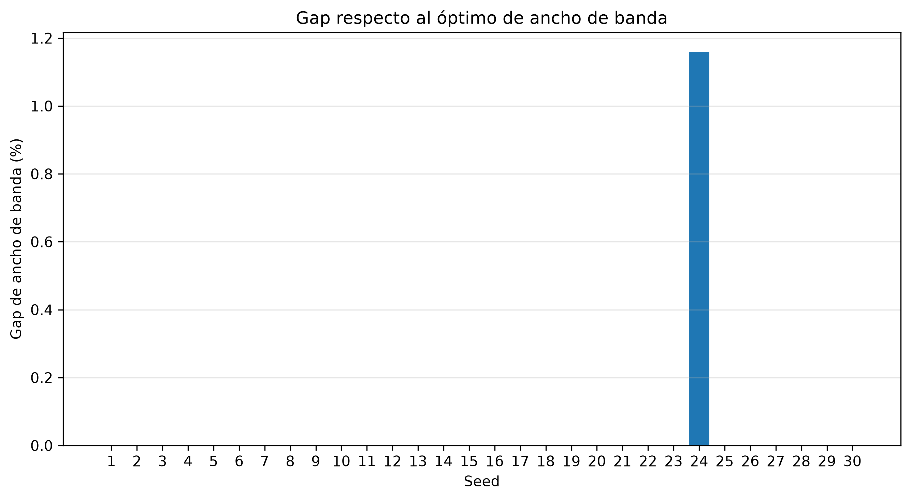
</p>

El **gap** representa la distancia porcentual entre el mejor ancho de banda encontrado por ABC y el óptimo exacto.

Para un objetivo que se desea maximizar:

$$
Gap_{BW} =
\frac{BW_{óptimo}-BW_{ABC}}
{BW_{óptimo}}
\times 100
$$

En:

```text
29 de las 30 ejecuciones
```

se obtuvo:

```text
Gap = 0 %
```

Esto significa que el algoritmo encontró exactamente el mayor ancho de banda posible.

Únicamente la:

```text
Seed 24
```

presentó un gap cercano a:

```text
1.16 %
```

La gráfica permite observar claramente que esta fue la única ejecución donde no se alcanzó el óptimo exacto.

Sin embargo, incluso en este caso la solución se mantuvo relativamente próxima al valor de referencia.

---

# 7. Reproducibilidad

La versión mejorada se ejecutó dos veces utilizando:

```text
Seed = 42
```

y exactamente los mismos parámetros.

Se compararon:

- frente Pareto;
- historial;
- población final.

### Resultado

```text
Frente Pareto idéntico:   SI
Historial idéntico:       SI
Población final idéntica: SI
```

Por lo tanto:

```text
RESULTADO: EJECUCIÓN REPRODUCIBLE
```

Esto confirma que una misma semilla permite reproducir nuevamente el comportamiento de la ejecución.

---

# 8. Frente de Pareto de referencia empírico

Los frentes de las 30 ejecuciones fueron posteriormente combinados.

El objetivo fue determinar cuántas soluciones diferentes fueron descubiertas y cuáles permanecían globalmente no dominadas.

### Resultado

| Indicador | Cantidad |
|---|---:|
| Soluciones combinadas | 1005 |
| Soluciones únicas | 44 |
| Frente de referencia | 40 |
| Dominadas eliminadas | 4 |

El proceso puede resumirse como:

```text
30 frentes Pareto
       │
       ▼
1005 apariciones
       │
       ▼
44 soluciones únicas
       │
       ▼
Eliminar dominadas
       │
       ▼
40 soluciones no dominadas
```

Un resultado particularmente importante es la reducción de:

```text
1005 apariciones
```

a solamente:

```text
44 soluciones diferentes
```

Esto muestra que muchas de las mismas rutas fueron encontradas repetidamente por distintas semillas.

De las 44 soluciones diferentes:

```text
40
```

permanecieron globalmente no dominadas.

Estas soluciones forman el:

**Frente de Pareto de referencia empírico.**

> Se utiliza el término "empírico" porque el conjunto se construye a partir de las soluciones encontradas durante las 30 ejecuciones y no mediante una enumeración exacta de todo el espacio de búsqueda.

---

# 9. Comparación ilustrativa Original vs Mejorada

Finalmente se realizó una comparación directa entre la implementación original y la versión mejorada.

Para mantener condiciones similares se utilizaron:

```text
Seed:         42
Origen:       52
Destino:      96
Abejas:       30
Iteraciones:  250
```

Debido a que la implementación original calculaba algunas métricas de manera diferente, las rutas encontradas por ambas versiones fueron **reevaluadas mediante las mismas ecuaciones QoS**.

---

## 9.1 Gap respecto a los óptimos

<p align="center">
  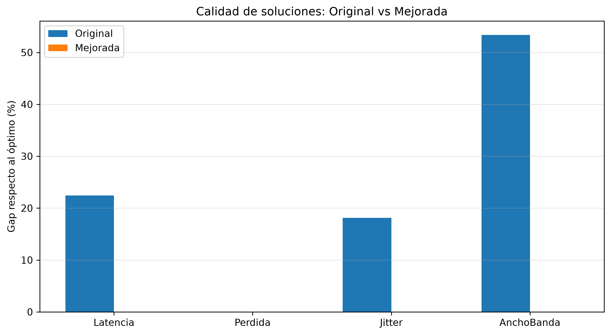
</p>

Los resultados fueron:

| Métrica | Original | Mejorada |
|---|---:|---:|
| Latencia | 22.42 % | 0 % |
| Pérdida | 0 % | 0 % |
| Jitter | 18.14 % | 0 % |
| Ancho de banda | 53.38 % | 0 % |

La gráfica permite observar que la versión mejorada alcanzó los cuatro óptimos individuales durante esta ejecución.

La versión original también alcanzó el óptimo de pérdida, pero presentó diferencias importantes en:

```text
Latencia
Jitter
Ancho de banda
```

La diferencia más grande apareció en ancho de banda, con un gap aproximado de:

```text
53.38 %
```

para la versión original.

---

## 9.2 Cantidad de soluciones Pareto

<p align="center">
  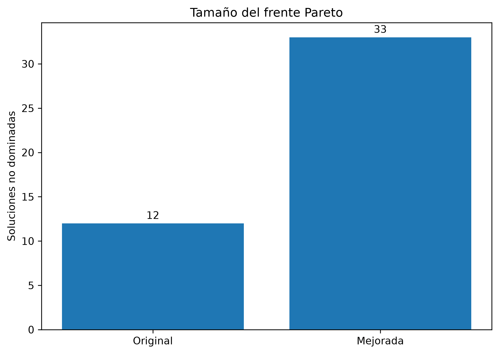
</p>

Después de reevaluar las rutas de ambas versiones mediante las mismas definiciones QoS se obtuvo:

| Versión | Soluciones no dominadas |
|---|---:|
| Original | 12 |
| Mejorada | 33 |

La gráfica permite observar que, en esta ejecución, la versión mejorada produjo un conjunto considerablemente mayor de soluciones no dominadas.

Esto resulta relevante en un problema multiobjetivo, ya que un frente más amplio puede ofrecer una mayor variedad de alternativas de compromiso entre las métricas QoS.

---

## 9.3 Tiempo de ejecución

<p align="center">
  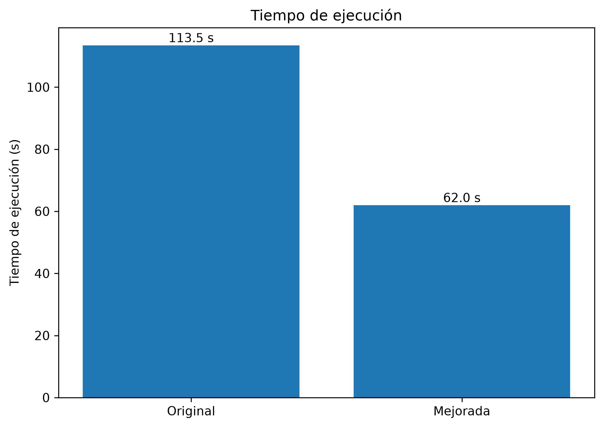
</p>

Los tiempos obtenidos fueron:

| Versión | Tiempo |
|---|---:|
| Original | 113.48 s |
| Mejorada | 61.96 s |

En esta ejecución particular, la versión mejorada necesitó menos tiempo para completar las 250 iteraciones.

La diferencia observada fue aproximadamente:

```text
Original: 113.48 s
Mejorada:  61.96 s
```

Por lo tanto, además de obtener mejores valores para tres de los cuatro objetivos en esta comparación, la versión mejorada también presentó un menor tiempo de ejecución.

> El tiempo puede depender del equipo, carga del sistema y entorno de ejecución. Por esta razón debe interpretarse como el resultado de esta ejecución específica y no como una garantía general de rendimiento.

---

## Alcance de la comparación

La comparación entre Original y Mejorada se realizó utilizando únicamente:

```text
Seed = 42
```

Su objetivo es **mostrar de manera ilustrativa el efecto de las modificaciones realizadas**.

Por lo tanto, estos resultados no deben interpretarse como una comparación estadística completa entre ambas implementaciones.

La evaluación de robustez mediante 30 semillas se realizó específicamente sobre la versión final mejorada.

---

# 10. Resumen general

Los experimentos realizados permitieron comprobar diferentes características de la versión final.

| Aspecto evaluado | Resultado principal |
|---|---|
| Correctitud de rutas | 30 / 30 válidas |
| Correctitud del fitness | 30 / 30 correctos |
| Frente Pareto | 0 soluciones dominadas |
| Iteraciones seleccionadas | 250 |
| Corridas con diferentes seeds | 30 |
| Éxito latencia | 100 % |
| Éxito pérdida | 100 % |
| Éxito jitter | 100 % |
| Éxito ancho de banda | 96.67 % |
| Éxito completo | 96.67 % |
| Diversidad promedio | 0.9258 |
| Pareto promedio | 33.5 |
| Reproducibilidad | Confirmada |
| Soluciones Pareto únicas globales | 44 |
| Frente empírico de referencia | 40 |

# 10. Evaluación con múltiples pares origen-destino

Después de realizar los experimentos sobre el par principal `52 → 96`, se evaluó la versión mejorada utilizando diferentes pares origen-destino dentro de la misma topología.

Se utilizaron seis pares con diferentes distancias mínimas:

| Par | Origen | Destino | Saltos mínimos |
|---|---:|---:|---:|
| P01 | 52 | 96 | 3 |
| P02 | 7 | 59 | 2 |
| P03 | 81 | 25 | 4 |
| P04 | 22 | 92 | 2 |
| P05 | 46 | 26 | 3 |
| P06 | 94 | 63 | 4 |

Para cada par se realizaron 10 ejecuciones utilizando diferentes semillas, manteniendo:

```text
Abejas:       30
Iteraciones:  250
Seeds/par:    10
```

En total se realizaron:

```text
6 pares × 10 semillas = 60 ejecuciones
```

Antes de ejecutar el algoritmo ABC se calcularon de manera independiente los óptimos individuales de referencia para cada par:

- mínima latencia;
- mínima pérdida de paquetes;
- mínimo jitter;
- máximo ancho de banda disponible.

Posteriormente, las soluciones encontradas por el algoritmo se compararon con estos valores para determinar la frecuencia con la que se alcanzó cada óptimo.

## 10.1 Resultados por par

Los resultados obtenidos fueron:

| Par | Pareto prom. | Diversidad | Latencia | Pérdida | Jitter | Ancho de banda | Éxito completo |
|---|---:|---:|---:|---:|---:|---:|---:|
| P01 | 33.50 | 0.8950 | 100 % | 100 % | 100 % | 100 % | 100 % |
| P02 | 28.00 | 0.8898 | 100 % | 100 % | 100 % | 90 % | 90 % |
| P03 | 44.20 | 0.9164 | 100 % | 90 % | 100 % | 100 % | 90 % |
| P04 | 21.30 | 0.8660 | 100 % | 100 % | 100 % | 10 % | 10 % |
| P05 | 10.00 | 0.8297 | 100 % | 100 % | 100 % | 0 % | 0 % |
| P06 | 47.80 | 0.9114 | 100 % | 100 % | 100 % | 100 % | 100 % |

La latencia y el jitter alcanzaron sus valores óptimos en todas las ejecuciones realizadas.

La pérdida de paquetes también mostró un comportamiento estable, excepto en el par `P03`, donde el óptimo fue alcanzado en el 90 % de las ejecuciones.

La principal diferencia entre los pares se presentó en el ancho de banda.

En `P01` y `P06` se alcanzó el óptimo en todas las ejecuciones, mientras que en `P04` solamente se alcanzó en el 10 % de las pruebas y en `P05` no se alcanzó en ninguna ejecución.

## 10.2 Resultado global

Considerando las 60 ejecuciones realizadas, se obtuvo:

| Objetivo | Tasa de éxito |
|---|---:|
| Latencia | 100 % |
| Pérdida | 98.33 % |
| Jitter | 100 % |
| Ancho de banda | 66.67 % |
| Éxito completo | 65 % |

Los resultados muestran que el comportamiento del algoritmo no se limita únicamente al par `52 → 96`.

La latencia y el jitter mantuvieron un comportamiento consistente en todos los pares evaluados, mientras que la pérdida de paquetes presentó solamente una falla entre las 60 ejecuciones.

El ancho de banda fue el objetivo que presentó una mayor dificultad, especialmente en los pares `P04` y `P05`.

Esto muestra que la capacidad del algoritmo para encontrar la ruta con el mayor ancho de banda disponible puede depender en mayor medida de las características del par origen-destino.

## 10.3 Archivos generados

Los resultados del experimento se almacenan en:

```text
Resultados/Mejorada/05_MultiplesPares/
```

Los archivos principales son:

```text
ParesSeleccionados.csv
OptimosPorPar.csv
ResumenCorridas.csv
ResumenPorPar.csv
```

Además, para cada par y cada semilla se almacenan:

```text
FrentePareto.csv
HistorialABC.csv
```

Esto permite revisar de manera individual las soluciones encontradas en cada ejecución y conservar un registro completo del experimento.

---

# Conclusión

Los resultados obtenidos muestran que la versión mejorada del algoritmo ABC Multiobjetivo presenta un comportamiento favorable para la selección de rutas considerando diferentes métricas de Calidad de Servicio.

El experimento realizado con diferentes números de iteraciones permitió observar que aumentar la cantidad de búsqueda mejora progresivamente la probabilidad de alcanzar los óptimos individuales. A partir de estos resultados se seleccionaron **250 iteraciones**, ya que esta configuración alcanzó una tasa de éxito del 100 % en las diez semillas evaluadas, sin requerir el mayor tiempo de ejecución observado con 400 iteraciones.

Posteriormente, utilizando la configuración seleccionada, se realizaron 30 ejecuciones independientes sobre el par principal `52 → 96`.

En estas pruebas se obtuvo:

```text
Éxito latencia:       100 %
Éxito pérdida:        100 %
Éxito jitter:         100 %
Éxito ancho de banda: 96.67 %
Éxito completo:       96.67 %
```

Además, los tamaños del frente de Pareto y los valores de diversidad se mantuvieron relativamente estables entre las diferentes semillas. La prueba de reproducibilidad también confirmó que una misma configuración y semilla permiten obtener nuevamente los mismos resultados.

La construcción del frente de referencia empírico permitió reunir las soluciones encontradas durante las 30 ejecuciones. De 1005 apariciones se identificaron 44 rutas diferentes, de las cuales 40 permanecieron globalmente no dominadas.

También se realizó una comparación ilustrativa entre la versión original y la versión mejorada. En la ejecución analizada, la versión mejorada obtuvo un mayor número de soluciones no dominadas, redujo los gaps respecto a los óptimos individuales y presentó un menor tiempo de ejecución.

Finalmente, la evaluación se amplió utilizando seis pares origen-destino diferentes y un total de 60 ejecuciones.

Considerando todas estas pruebas se obtuvo:

```text
Éxito latencia:       100 %
Éxito pérdida:        98.33 %
Éxito jitter:         100 %
Éxito ancho de banda: 66.67 %
Éxito completo:       65 %
```

Estos resultados muestran que el comportamiento del algoritmo no se limita únicamente al par principal `52 → 96`. La latencia, la pérdida de paquetes y el jitter mantuvieron tasas de éxito altas en los diferentes escenarios evaluados.

Sin embargo, el ancho de banda presentó una mayor dificultad en algunos pares origen-destino. Esto indica que la capacidad del algoritmo para encontrar la ruta con el mayor ancho de banda disponible puede depender en mayor medida de las características del problema evaluado.

En conjunto, las verificaciones y experimentos realizados proporcionan evidencia sobre la correctitud, diversidad, robustez y reproducibilidad de la versión mejorada del algoritmo. Al mismo tiempo, los resultados permiten identificar la búsqueda del máximo ancho de banda como un aspecto que todavía puede mejorarse.