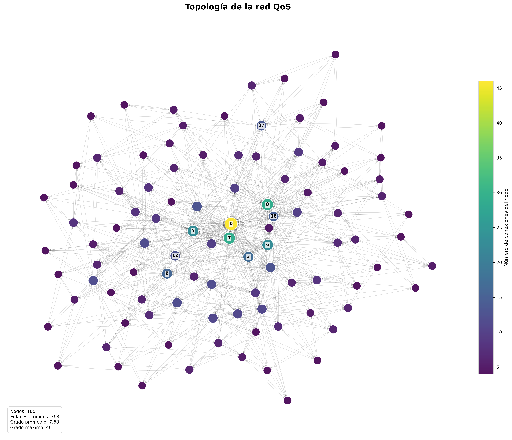
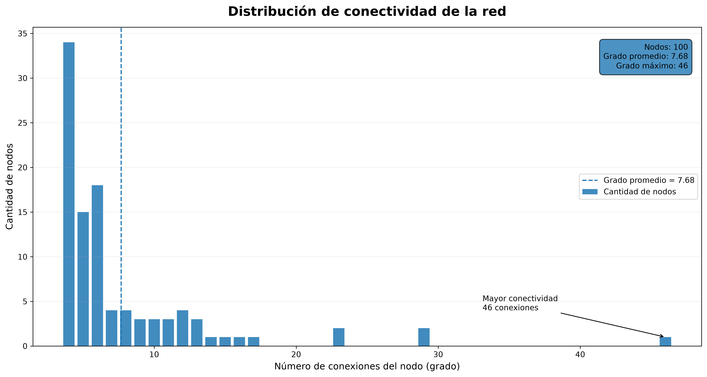

# Visualización y análisis de la topología de red

La visualización de la red permite comprobar que el dataset fue generado correctamente y analizar las características estructurales de la topología utilizada durante los experimentos.

Durante el desarrollo del proyecto se utilizaron dos versiones.

 - <strong>Versión inicial:</strong> Visualización general de nodos y enlaces.
 - <strong>Versión mejorada</strong> Visualización, análisis de conectividad,  identificación de hubs.


Se mejoro la visualizacion principalmente para comprobar la construcción del grafo a una herramienta que permite **caracterizar y analizar la instancia de red** antes de ejecutar el algoritmo de optimización.

---

# 1. Primera versión

La primera implementación tenía como objetivo comprobar visualmente que el dataset podía convertirse correctamente en un grafo dirigido.

El archivo utilizado era:

```text
Red_datasets/
    └── Original
        └── DatasetRed_Normalizado.csv
```
En esta etapa las métricas QoS habían sido previamente normalizadas.

---

## 1.1 Carga del dataset

```python
df = pd.read_csv(csv_path)
```

Cada fila representaba una conexión dirigida entre dos nodos.

Por ejemplo:

| Origen | Destino |
| -----: | ------: |
|      0 |       5 |
|      5 |      12 |

Representa:

```text
0 → 5 → 12
```

---

## 1.2 Construcción del grafo

El grafo se construía mediante:

```python
G = nx.from_pandas_edgelist(df, source="Origen",target="Destino",create_using=nx.DiGraph())
```

Donde:

* `Origen` representa el nodo desde el cual parte el enlace.
* `Destino` representa el nodo al que llega.
* `nx.DiGraph()` conserva la dirección de las conexiones.

---

## 1.3 Posición de los nodos

Para distribuir los nodos dentro de la figura se utilizaba:

```python
pos = nx.spring_layout(G,seed=42)
```

`spring_layout()` utiliza un modelo basado en fuerzas, que permite obtener una disposición reproducible cada vez que se genera la gráfica.

---

## 1.4 Representación

La red completa se dibujaba utilizando:

```python
nx.draw(G,pos,with_labels=True,node_size=500 arrows=True)
```

Todos los nodos utilizaban:

* el mismo tamaño;
* el mismo color;
* una etiqueta visible;
* el mismo nivel de importancia visual.

---

## Resultado de la primera versión

<p align="center">
  

<p align="center">
  <em>Figura 1. Primera representación de la topología de red.</em>
</p>

Esta representación permitía validar:

* La existencia de los nodos.
* Las conexiones entre ellos.
* La dirección de los enlaces.
*La construcción general del grafo.

Sin embargo, al aumentar la cantidad de conexiones comenzaron a observarse algunas limitaciones.

---

# 2. Limitaciones detectadas

La primera versión era útil para comprobar que el grafo existía, pero proporcionaba poca información sobre sus propiedades estructurales.

El principal problema puede observarse en la zona central de la gráfica. Al mostrar simultáneamente todos los nodos y sus enlaes con sus respectivas etiquetas, se produce una gran cantidad de elementos superpuestos.

Además:

```text
Nodo con 5 conexiones  → mismo vizualización
Nodo con 46 conexiones → mismo vizualización
```

Por lo tanto, no era posible identificar fácilmente cuáles nodos tenían mayor importancia estructural.

---

# 3. Segunda versión: visualización mejorada

Para solucionar estas limitaciones se desarrolló una nueva versión.

Ahora se utiliza directamente:

```text
Red_datasets/
└── Mejorada/
    └── DatasetRed.csv
```

A diferencia de la implementación anterior, esta versión trabaja con las **métricas QoS originales del dataset**, evitando utilizar el antiguo archivo previamente normalizado.

---

## 3.1 Análisis de conectividad

La segunda versión incorpora un análisis de conectividad de los nodos.

Para ello se genera temporalmente una representación no dirigida:

```python
G_undirected = G.to_undirected()

grados = dict(G_undirected.degree())
```

Esto permite analizar cuántos nodos diferentes están conectados con cada nodo independientemente del sentido del enlace.

---

# 4. Identificación de hubs

Una de las mejoras principales consiste en identificar automáticamente los nodos con mayor conectividad.

```python
hubs = sorted(grados.items(),key=lambda x: x[1],reverse=True)[:10]
```

Con esto se seleccionan los:
```text
10 nodos con mayor grado
```
Estos nodos son considerados **hubs topológicos** debido a que concentran una cantidad elevada de conexiones.

---

## ¿Por qué son importantes?

Un nodo con muchas conexiones puede proporcionar un mayor número de alternativas durante la construcción de rutas.

Esto no significa que un hub necesariamente forme parte de la mejor ruta.

La calidad final depende también de:

* latencia;
* jitter;
* pérdida de paquetes;
* ancho de banda.

---

# 5. Tamaño de los nodos según conectividad

En la primera versión todos los nodos tenían:

```python
node_size=500
```

En la nueva versión el tamaño depende de su grado:

```python
node_sizes = [100 + np.sqrt(grados[nodo]) * 110 for nodo in G.nodes()]
```

Por lo tanto:

| Número de conexiones | Representación visual |
|---|---|
| Pocas conexiones | Nodo pequeño |
| Muchas conexiones | Nodo grande |


Se utiliza la raíz cuadrada para evitar que los nodos con grados muy elevados dominen completamente la gráfica.

---

# 6. Color según conectividad

También se utiliza el grado del nodo para determinar su color.

```python
node_colors = [grados[nodo] for nodo in G.nodes()]
```
De esta manera, el color y el tamaño transmiten simultáneamente información sobre la conectividad.

---

# 10. Resultado de la versión mejorada

<p align="center">
  

<p align="center">
  <em>Figura 2. Visualización mejorada de la red QoS.</em>
</p>

Ahora la interpretación es considerablemente más sencilla:

* <strong>Nodo pequeño y morado:</strong> Menor conectividad
* <strong>Nodo grande y amarillo:</strong>
Mayor conectividad

Los principales hubs también aparecen identificados mediante sus etiquetas.


---

# 11. Nueva visualizacion - Distribución de la conectividad

Además de mejorar la topología visual, se desarrolló una segunda herramienta dedicada específicamente a estudiar cómo se distribuyen las conexiones entre los nodos.

El análisis comienza nuevamente con:

```python
grados = dict(G.to_undirected().degree())
```

Los grados son almacenados en un arreglo:

```python
valores = np.array(list(grados.values()))
```

A partir de ellos se calculan distintas estadísticas.

```python
estadisticas = {
    "nodos": G.number_of_nodes(),
    "enlaces": G.number_of_edges(),
    "grado_minimo": int(valores.min()),
    "grado_promedio": float(valores.mean()),
    "grado_mediano": float(np.median(valores)),
    "grado_maximo": int(valores.max())
}
```

---

# 12. Construcción de la distribución

Para determinar cuántos nodos presentan cada número de conexiones se utiliza:

```python
valores, frecuencias = np.unique(grados,return_counts=True)
```

Por ejemplo:

```text
Grado       Cantidad de nodos
─────       ─────────────────
  4                34
  5                15
  6                18
  7                 4
  8                 4
  ...
 46                 1
```

Posteriormente se genera un gráfico de barras.

---

## Resultado

<p align="center">
  
</p>

<p align="center">
  <em>Figura 3. Distribución del grado de los nodos de la red.</em>
</p>

---

# 14. Interpretación de la distribución

La gráfica muestra que la conectividad no se encuentra distribuida uniformemente, la mayor parte de los nodos tiene relativamente pocas conexiones.

Sin embargo, existe un pequeño grupo de nodos con una conectividad considerablemente superior.

La diferencia entre ambos valores muestra la presencia de nodos altamente conectados.

Esto coincide con lo observado directamente en la representación de la topología.

---

# 18. Conclusión

La primera versión cumplía correctamente con su objetivo inicial:

> comprobar que el dataset podía representarse como una red dirigida.

Sin embargo, conforme avanzó el proyecto fue necesario obtener más información acerca de la estructura sobre la cual trabaja el algoritmo.

Esto proporciona una caracterización más completa de la red y establece una base experimental más sólida para posteriormente comparar el comportamiento de las diferentes versiones del algoritmo ABC.

---